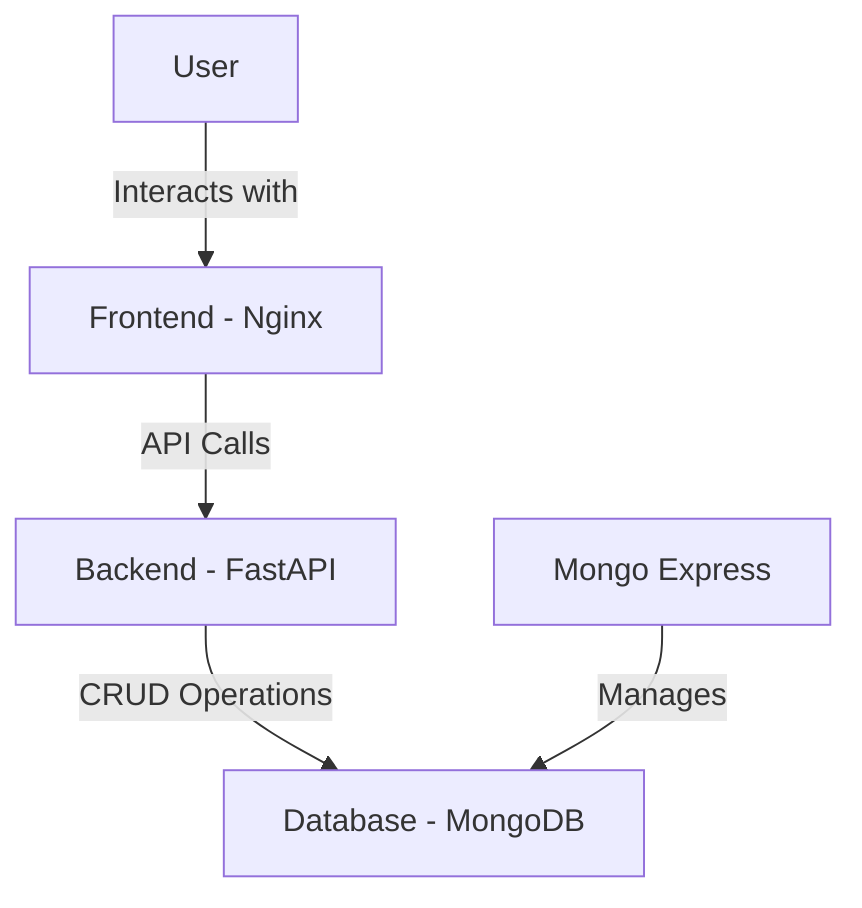

# 📝 ToDo-Dockr: Full-Stack Task Management Application

## 🚀 Project Overview

ToDo-Dockr is a modern, full-stack task management application designed to simplify your productivity workflow. Built with cutting-edge technologies, this application demonstrates a robust, scalable approach to web development.


## ✨ Key Features

- **Intuitive Task Management**
  - Create, read, update, and delete tasks with ease
  - Clean, responsive user interface
  - Real-time task tracking and management

- **Modern Tech Stack**
  - **Frontend:** HTML, CSS, with optional JavaScript
  - **Backend:** FastAPI (Python)
  - **Database:** MongoDB
  - **Containerization:** Docker
  - **Web Server:** Nginx

## 🛠 Technology Stack

| Layer | Technology | Purpose |
|-------|------------|---------|
| Frontend | HTML/CSS | User Interface |
| Backend | FastAPI | RESTful API Development |
| Database | MongoDB | Persistent Data Storage |
| Containerization | Docker | Deployment & Isolation |
| Web Server | Nginx | Static Content Serving |
| Admin Interface | Mongo Express | Database Management |

## 🔧 System Architecture



## 📦 Project Structure

```
todo-dockr/
│
├── frontend/
│   ├── Dockerfile
|   └── static/
│       └── index.html
│
├── backend/
│   ├── Dockerfile
|   └── src/mysite/
│       ├── __init__.py
│       └── main.py
│
├── mongodb/
│   └── .env
│
├── mongo-express/
│   └── .env
│
└── docker-compose.yml
```

## 🚀 Getting Started

### Prerequisites

- Docker
- Docker Compose
- Git

### Installation Steps

1. Clone the repository
   ```bash
   git clone https://github.com/blue-samarth/ddoocckkeerr
   ```

2. Configure Environment Variables
   - Create `.env` files in respective service directories
   - Add necessary configuration details

3. Build and Run
   ```bash
   docker-compose up --build
   ```

4. Access the Application
   - **App:** http://localhost
   - **API Docs:** http://localhost:8000/docs
   - **Database Admin:** http://localhost:8081

## 🔒 Key Features & Security

- **Containerization:** Each service runs in an isolated container
- **Persistent Storage:** MongoDB data persisted using Docker volumes
- **Environment Management:** Secure configuration via `.env` files

## 🧰 API Endpoints

| Method | Endpoint | Description |
|--------|----------|-------------|
| POST   | `/todos` | Create a new task |
| GET    | `/todos` | Retrieve all tasks |
| PUT    | `/todos/{todo_id}` | Update a specific task |
| DELETE | `/todos/{todo_id}` | Delete a specific task |

## 🤝 Contributing

1. Fork the repository
2. Create a feature branch
3. Commit your changes
4. Push to the branch
5. Create a Pull Request


## 🌟 Acknowledgments

- FastAPI Community
- Docker
- MongoDB
- Nginx

---

**Built with ❤️ by Samarth**

*Simplify your tasks, boost your productivity!* 🚀📋
